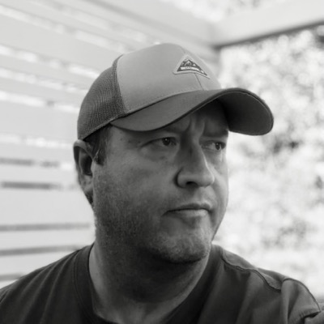
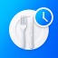

# Support

Welcome to **Rohr Software Support**.

If you need help with one of our applications, have encountered a problem, or would like to provide feedback or suggest a feature, we're happy to help.

## Contact Support

For support inquiries, please email:

**[rohr.software@rocketmail.com](mailto:rohr.software@rocketmail.com)**

When contacting us, please include:

* The name of the application you're using
* A brief description of the issue or question
* The device and operating system version, if relevant
* Any steps that reproduce the issue
* Screenshots or other details that may help us understand the problem

Providing as much detail as possible helps us investigate your request and respond more quickly.

## Why I Build These Apps

The apps I build come from real, everyday needs — moments where I, a friend, or a family member said, "I wish there was an app for that." I also got frustrated with how many apps today are built around ads and subscriptions, so I moved away from that model in favor of a one-time fee. Most of my apps use a freemium model, so you can try before you buy. I'm also building casual games, with some fun influence from my daughters along the way.

### Apps (iPhone & iPad)

| Title | Description | Release Date |
| --- | --- | --- |
|  [BudgetXP+: Personal Finance](https://apps.apple.com/us/app/budgetxp-personal-finance/id6802175358) | A personal finance app for iPhone and iPad. Track accounts, set budgets, log transactions, and understand your spending — everything you need to stay on top of your money, right in your pocket. | 8/26/2026 |
|  [MealBound](https://apps.apple.com/us/app/mealbound/id6813143038) | Your complete home meal planning companion. Build your recipe collection, plan the week ahead, and generate smart grocery lists. | 9/22/2026 |
|  Meduo | Track you and your family's medications, appointments, trending lab work, and personal journals. | TBD |

### macOS

| Title | Description | Release Date |
| --- | --- | --- |
|  [BudgetXP+: Desktop](https://apps.apple.com/us/app/budgetxp-desktop/id6812885419) | A powerful personal finance app built natively for macOS. Whether you're tracking everyday spending, setting monthly budgets, or watching your net worth grow, BudgetXP+ gives you the clarity and control to stay on top of your money. | TBD |

### Games

| Title | Description | Release Date |
| --- | --- | --- |
|  [Fox Dash: Wild Adventures](https://apps.apple.com/us/app/fox-dash-wild-adventures/id6808320477) | A fast-paced endless runner across 10 beautifully crafted worlds, each packed with unique obstacles and characters to unlock. | 9/16/2026 |

## Feedback & Feature Requests

We welcome feedback and suggestions. If there's a feature you'd like to see in one of our applications or an improvement you'd like to recommend, please send us an email with the details.

## Thank You

Thank you for using our applications and taking the time to contact us. We appreciate your feedback and are committed to providing reliable, useful software.

**Rohr Software**
[rohr.software@rocketmail.com](mailto:rohr.software@rocketmail.com)
